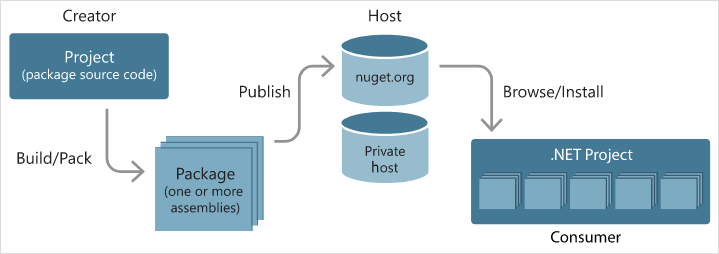

## 什么是Nuget

**NuGet是Microsoft开发平台的程序集包管理器**，它由客户端工具和服务端站点组成，客户端工具提供给用户管理和安装/卸载软件程序包，以及打包和发布程序包到NuGet服务端站点等功能，服务端站点存储已经发行的软件包，并为NuGet客户端软件包库提供服务，使软件包共享给其他的开发者。

**适用于任何现代开发平台的基本工具可充当一种机制，通过这种机制，开发人员可以创建、共享和使用有用的代码**。通常，此类代码捆绑到“包”中，其中包含编译的代码（如DLL）以及在使用这些包的项目中所需的其他内容。

对于.NET(包括.NET Core)，共享代码的Microsoft支持的机制则为NuGet ，其定义如何创建、托管和使用面向.NET的包，并针对每个角色提供适用工具。

简单来说，NuGet 包是具有`.nupkg`扩展的单个ZIP文件，此扩展包含编译代码(Dll)、与该代码相关的其他文件以及描述性清单(包含包版本号等信息)。 使用代码的开发人员共享创建包，并将其发布到公用或专用主机。 包使用者从适合的主机获取这些包，将它们添加到项目，然后在其项目代码中调用包的功能。 随后，NuGet自身负责处理所有中间详细信息。

由于NuGet支持公用`nuget.org`主机旁边的专用主机，因此，可以使用NuGet包来共享组织或工作组专用的代码。 此外，你还可以使用NuGet包作为一种便捷的方式，将自己的代码用于除你自己项目之外的任何其他项目。 简而言之，NuGet包是可共享的代码单元，但不需要暗示任何特定的共享方式。

## 相关文章

* [乘风破浪，遇见最佳跨平台跨终端框架.Net Core/.Net生态 - 面向所有项目风格的Nuget打包发布/离线部署(.NET Framework、.NET Standard)](https://www.cnblogs.com/taylorshi/p/16623786.html)